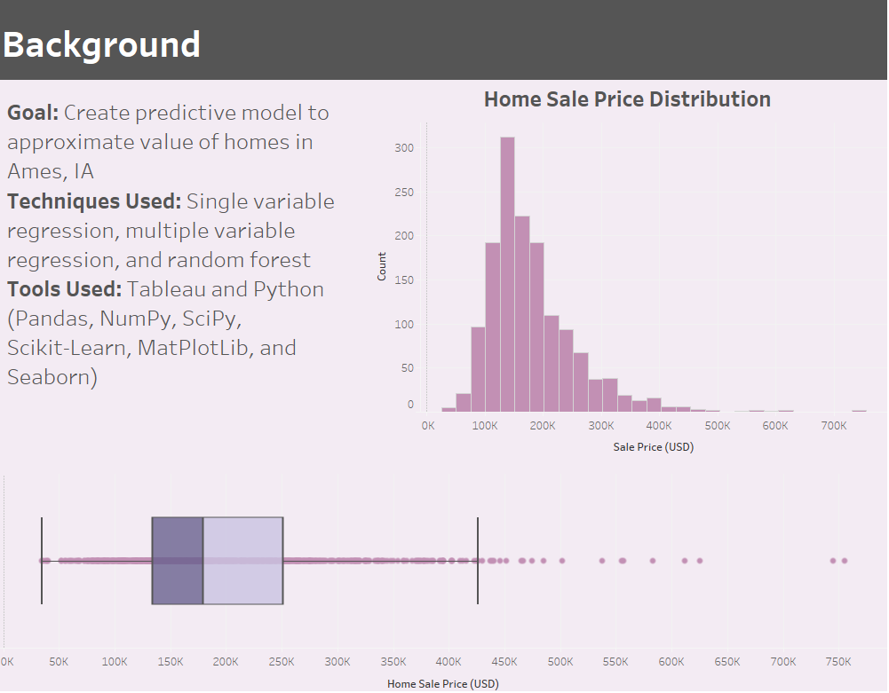
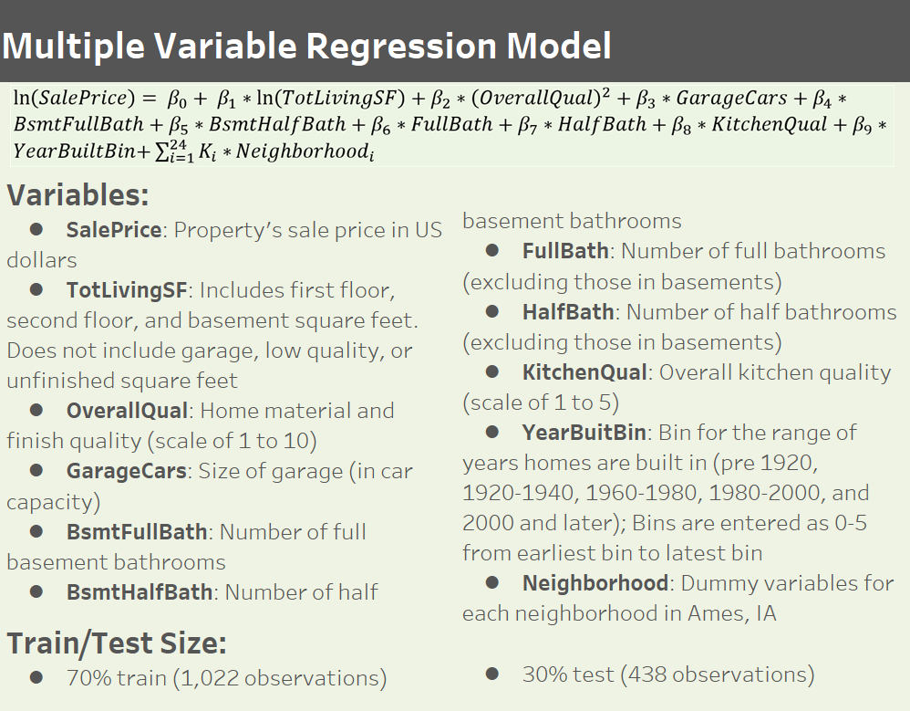
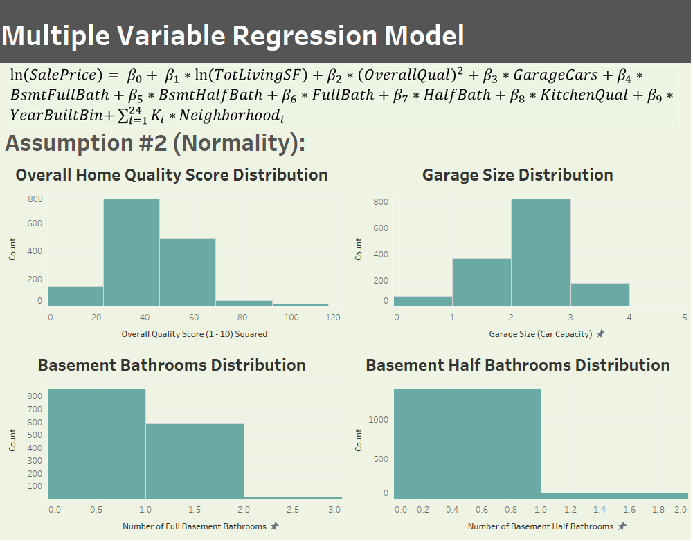
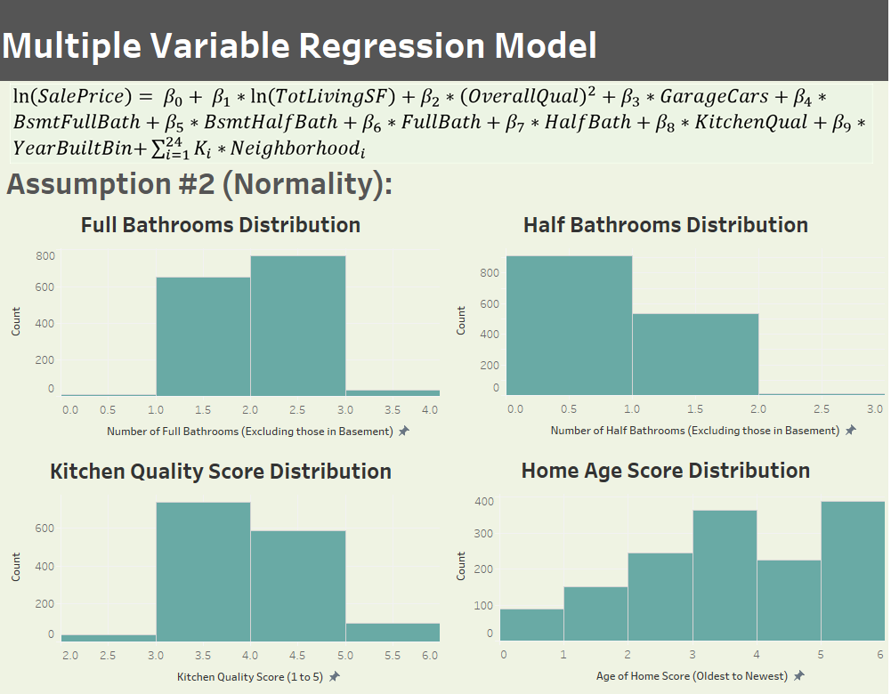
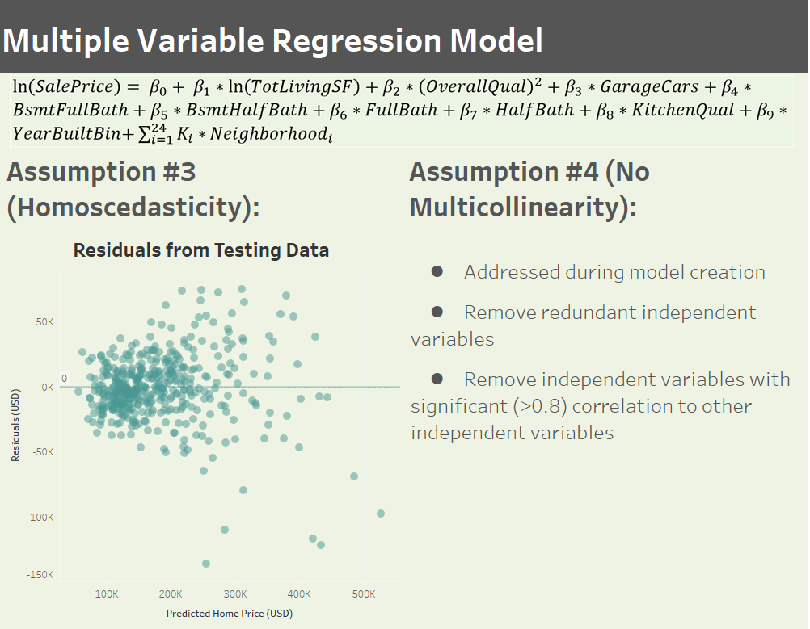
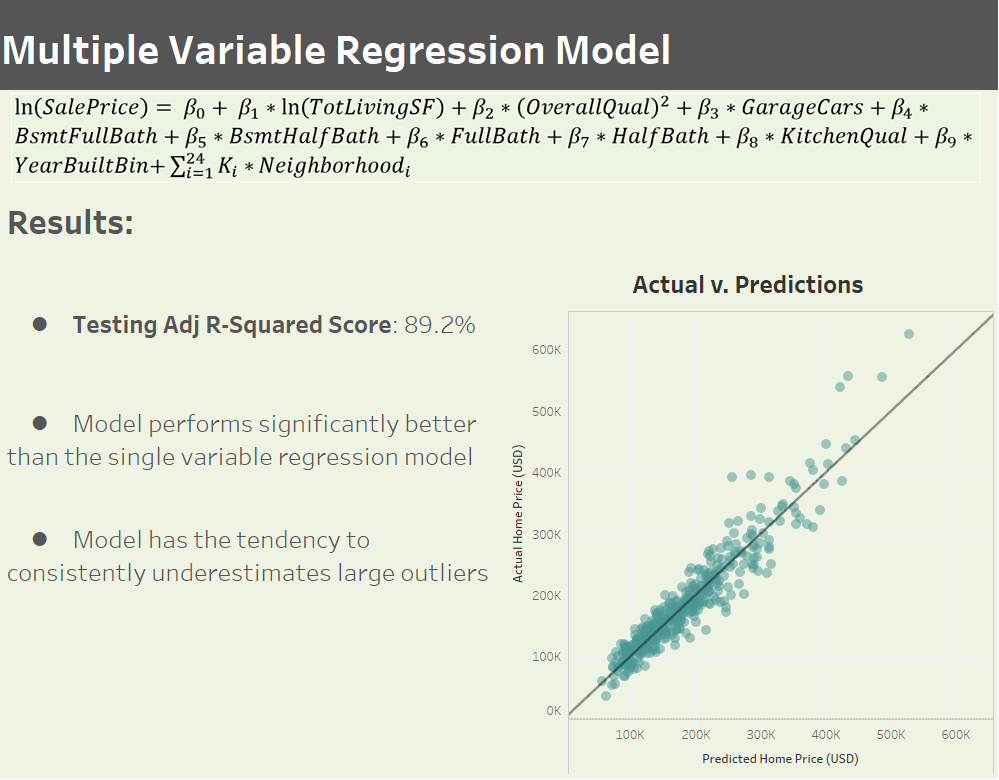
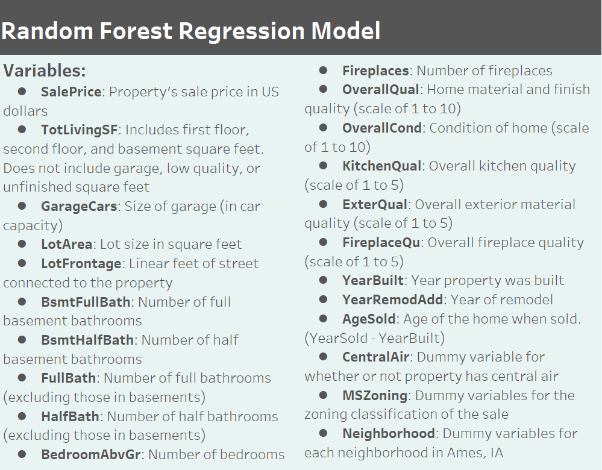

# Housing Prices Predictor
## Files
* Project created to enter into [Kaggle competition](https://www.kaggle.com/c/house-prices-advanced-regression-techniques/) to predict housing prices for listings in Ames, IA using variety of metrics and descriptive factors
* The [01-cleaning.ipynb](https://github.com/mileslucey/housing_prices_predictor/blob/master/01-cleaning.ipynb) Jupyter Notebook cleans the raw housing data taken from [Kaggle](https://www.kaggle.com/c/house-prices-advanced-regression-techniques/)
* The [02-exploration_numeric_variables.ipynb](https://github.com/mileslucey/housing_prices_predictor/blob/master/02-exploration_numeric_variables.ipynb) and  [03-exploration_categorical_variables.ipynb](https://github.com/mileslucey/housing_prices_predictor/blob/master/03-exploration_categorical_variables.ipynb) Jupyter Notebooks explore the variables in the data and those variables' relationships with housing prices
* The [04-single_variable_regression.ipynb](https://github.com/mileslucey/housing_prices_predictor/blob/master/04-single_variable_regression.ipynb) Jupyter Notebook produces a single variable linear regression model that demonstrates the relationship between housing prices and home square feet
* The [05-multiple_variable_regression.ipynb](https://github.com/mileslucey/housing_prices_predictor/blob/master/05-multiple_variable_regression.ipynb) Jupyter Notebook produces a multiple variable linear regression model that demonstrates the relationship between housing prices and home square feet, home quality, exterior material quality, kitchen quality, garage size, number of bathrooms, number of bedrooms, home age, and neighborhood 
* The [06-random_forest.ipynb](https://github.com/mileslucey/housing_prices_predictor/blob/master/06-random_forest.ipynb) Jupyter Notebook produces a random forest regression to model home prices
## Final Product
* See published presentation/dashboard [here](https://public.tableau.com/profile/miles.lucey#!/vizhome/home_prices_predictor/HomePricePrediction?publish=yes)
* Findings are summarized in the slides below:

